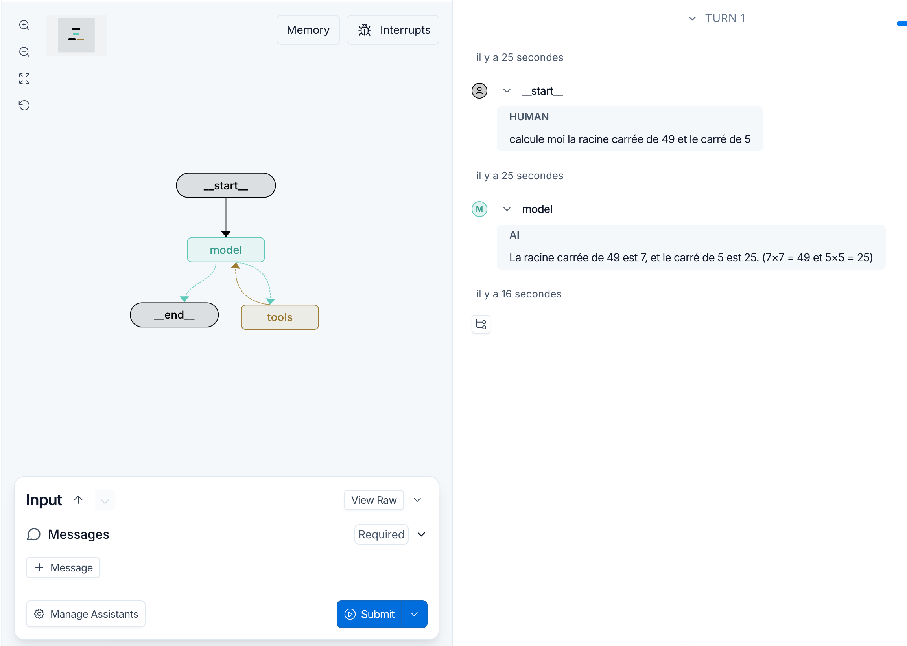

#  TP 5 - Langgraph Studio  : Prof SARA RETAL

## Prerequis communs
Dans ce TP, nous developpons un agent langgraph capable de calculer le carré ou la racine carré d'un nombre

- langgraph studio

## Simulation 

